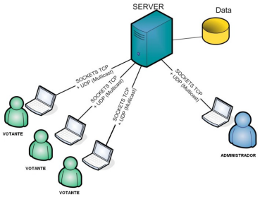

# trabaho-sistema-distribuido

## Sockets e Streams

### Questão 1 - Um registro de uma pessoa é constituído de um nome, seu CPF e sua idade. Crie uma classe Pessoa que represente esta informação. Crie uma subclasse de OutputStream chamada PessoasOutputStream que envia os dados de um conjunto (array) de Pessoas, seguindo a seguinte regra:

<ol type="a">
    <li>Primeiro envie o número de pessoas que terão dados enviados pelo stream;</li>
    <li>Depois para cada pessoa, deve ser enviada o número de bytes utilizados para
gravar o nome da pessoa, o nome da pessoa, seu CPF e sua idade.</li>
    <li>O construtor da subclasse deve receber como parâmetros: (i) um array de Pessoas
que representam os dados a serem transmitidos e um OutputStream de destino, para
onde as informações do conjunto de pessoas devem ser enviadas.</li>
    <li>Teste sua implementação utilizando como destino a saída padrão (System.out).</li>
    <li>Teste sua implementação utilizando como destino um arquivo (FileOutputStream).</li>
    <li>Teste sua implementação utilizando como destino um servidor remoto (TCP).</li>
</ol>

### Questão 2 - Crie uma subclasse para InputStream chamada PessoasInputStream que lê os dados gerados pelo stream do exercício anterior.

<ol>
    <li>O construtor da subclasse deve receber como parâmetro um InputStream de
origem, de onde as sequências de bytes serão lidas. </li>
    <li>Teste sua implementação utilizando como origem a entrada padrão (System.in) </li>
    <li>Teste sua implementação utilizando como origem um arquivo (FileInputStream).</li>
    <li>Teste sua implementação utilizando como destino um servidor remoto (TCP).</li>
</ol>

## Serialização Java

### Questão 3 - Implemente um serviço remoto através da comunicação cliente-servidor. A comunicação entre cliente e servidor deve ser implementada via sockets (TCP ou UDP) que trocam fluxos de bytes. Cada estudante deve definir um serviço remoto, sugestões.

As estruturas de dados devem ser ‘serializadas’ para serem enviadas em
mensagens, ou seja, deve ser feito o empacotamento e desempacotamento das
mensagens no lado cliente e no lado servidor, ou seja:

<ul>
    <li>O cliente deve empacotar a mensagem de <strong>request</strong> antes de enviar para o servidor;</li>
    <li>O cliente deve desempacotar a mensagem de <strong>reply</strong> enviada pelo servidor;</li>
    <li>O servidor deve desempacotar a mensagem de <strong>requisição</strong> do cliente;</li>
    <li>O servidor deve empacotar a mensagem de <strong>reply</strong> e enviar para o cliente;</li>
</ul>

## Representação externa de dados

### Questão 4 - Implemente uma aplicação distribuída que suporte um sistema de votações. O envio de votos têm um prazo máximo, finalizado esse tempo o servidor não aceita mais votações e calcula o total de votos, respectivas percentagens e candidato ganhador. O eleitor começa a votação através de um login. Em resposta, o servidor envia-lhe uma lista de candidatos que estão em votação, o que permitirá ao eleitor votar em um determinado candidato. Além dos eleitores, existem também os administradores do sistema que têm a capacidade de introduzir e remover candidatos para votação e que poderão enviar notas informativas para os eleitores.

O login, envio da lista de candidatos e de votos deverá ser implementada usando
comunicação unicast com API de sockets TCP em Java, enquanto que toda a comunicação
multicast será feita utilizando sockets UDP. O multicast será utilizado exclusivamente para
as notas informativas enviada pelos administradores do sistema. O servidor deverá ser
multi-threaded.

Para a representação externa de dados nas chamadas remotas (métodos,
argumentos e resultados), sugere-se que seja implementada através de protocol buffers.
Contudo, versões em XML ou JSON também são aceitas.

    

